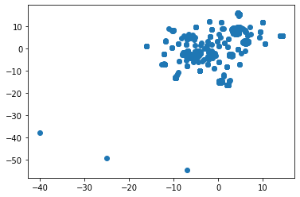
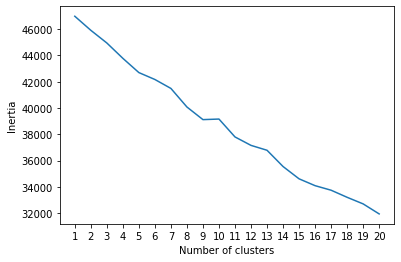

# Cryptocurrency Clusters

For this assignment we are tasked to review if the cryptocurrencies can be grouped to create a classification system for an investment bank’s new investment. The bank is new to the cryptocurrencies market and would like to have more insight on the market. 

### Using the t-SNE Model
There does not appear to be distinct clusters. There are about three separate dots that float separately from the main cluster which appears to be more like outliers than another cluster.

### Cluster Analysis with k-Means
Based on the k-Means model, a clear elbow could not be identified.

